## FlutChat
# Flutter Messaging App - Flutter & Firebase

> version 0.1.0 - alpha

- The FlutChat Messaging app has material UI. It has been build using Flutter & Firebase. This is still work in progress but most of the main features like messaging, searching and themes are working good.

- This app can be easily integrated with any flutter project.

- It has multi theaming option works well is both Android & IOS


## Release
cheack releases for the current version of app -----> [DOWNLOAD](https://github.com/aruntemme/flutchat/releases) 

## Screenshots of the application 

Light Mode | Dark Mode
------------ | -------------
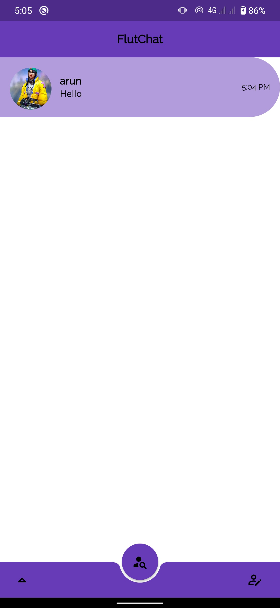 | 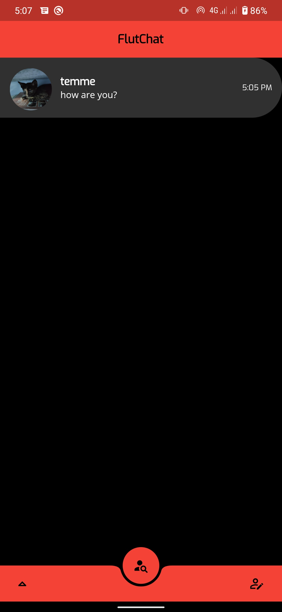
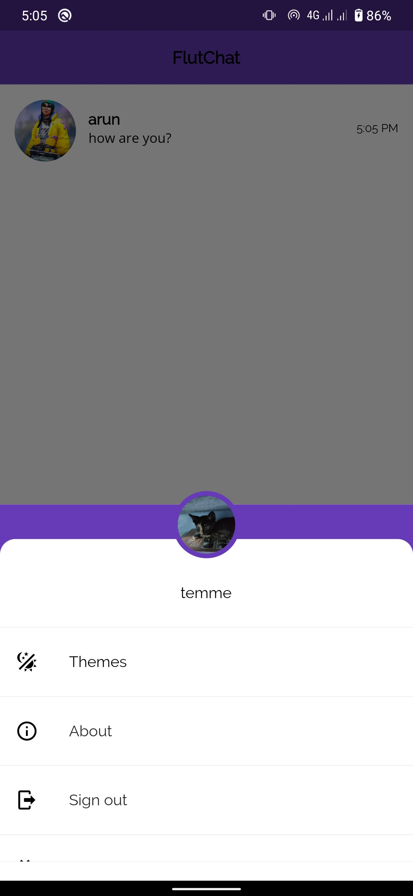 | 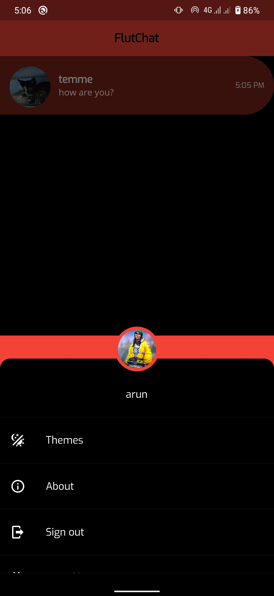
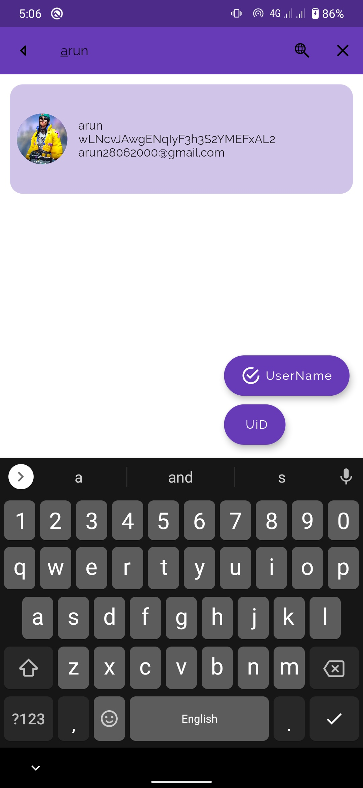 | 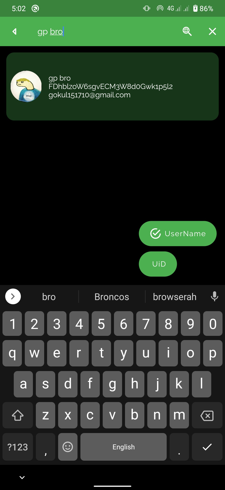
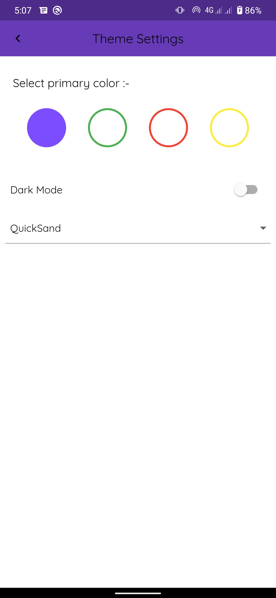 | 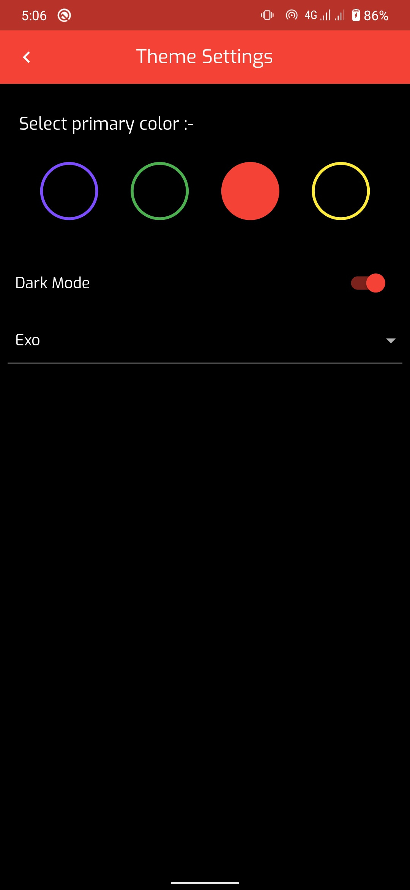
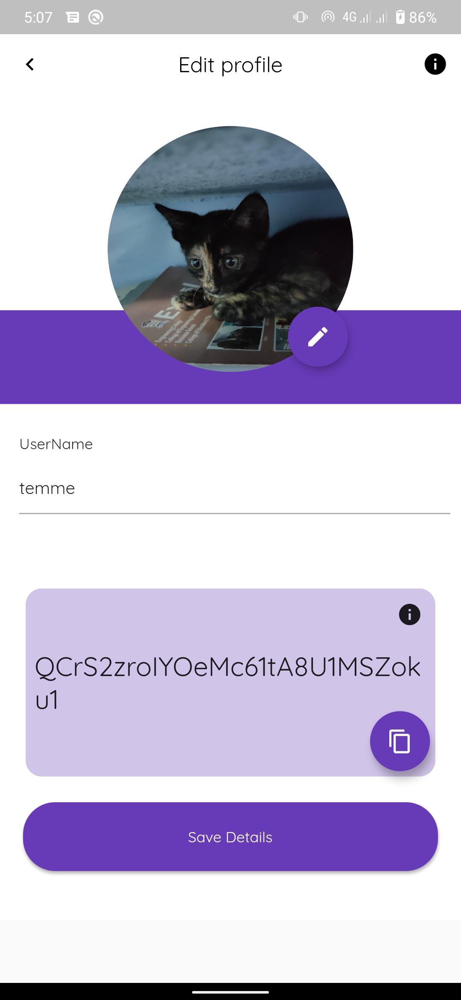 | 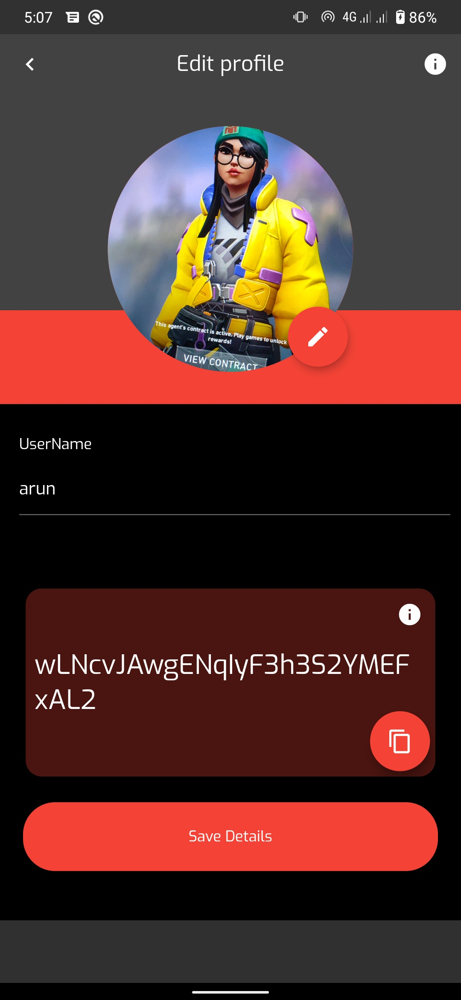
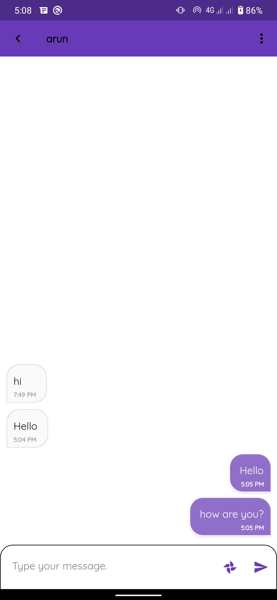 | 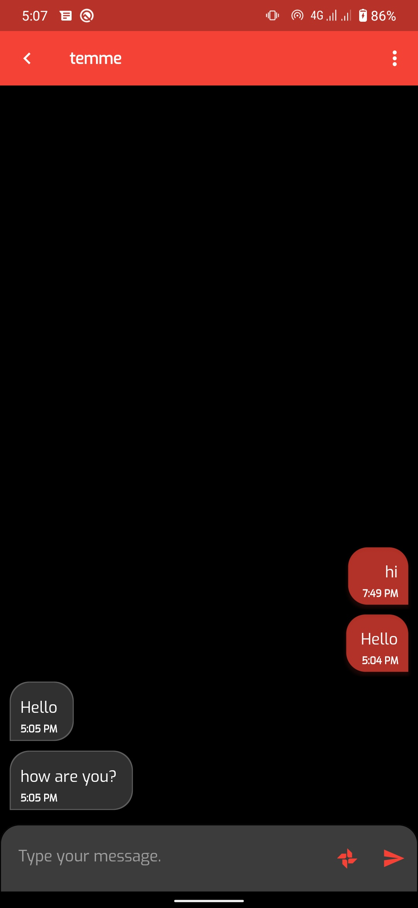
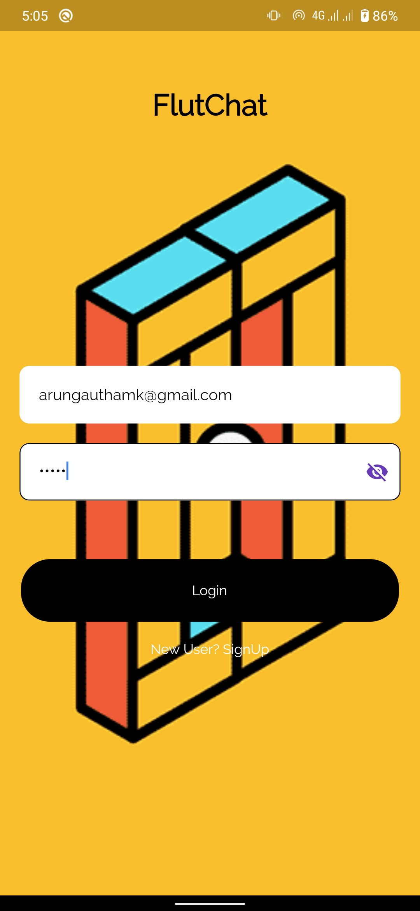 | 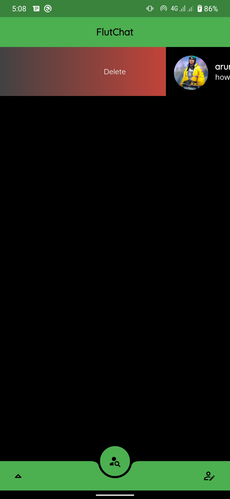


## Project Setup

In order to set up the project, please follow below steps:

### Flutter setup

1. Install package dependencies:

```
flutter pub get
```

2. Go to google firebase and create your own project and extract the googleservices.json.


3. Run the project by running command:

```
flutter run -v
```

4. Use one of these commands to build the project:

```
flutter build ios
flutter build apk --split-per-abi
flutter build appbundle
```

5. If any issue (run the below command to troubleshoot):

```
flutter doctor
```

For help getting started with Flutter, check [online documentation](https://flutter.dev/docs), which offers great tutorials, samples, guidance on mobile development, and a full API reference.


## Authors

>  [Arun K ](https://github.com/aruntemme) 


## Feel Free to Contract

* Gmail : arungauthamk@gmail.com
* Twitter : https://www.twitter.com/aruntemme

